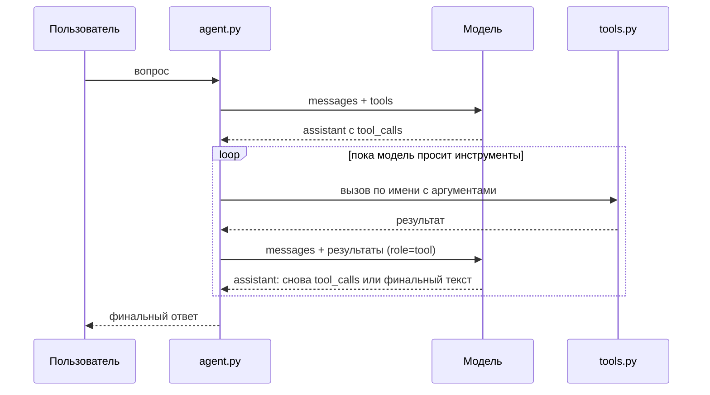

# Health Agent

Минимальный LLM-агент с tool calling поверх данных трекера здоровья.

Пользователь спрашивает на естественном языке — «сколько я вчера прошёл?», «я нормально
сплю на этой неделе?» — агент вызывает инструменты, получает реальные цифры и отвечает
на данных пользователя, а не общими словами из интернета.

> **Репозиторий содержит заготовку, а не рабочий агент.** Цикл вызова инструментов не
> дописан, и это сделано намеренно: проект используется как материал для технического
> интервью. См. [TASK.md](TASK.md).

## Стек

- Python 3.10+
- `requests` — единственная зависимость рантайма
- OpenRouter как шлюз к модели, по умолчанию `openai/gpt-4o-mini`
- OpenAI-совместимый формат `tools` / `tool_calls`

Никаких агентных фреймворков: LangChain, LlamaIndex и прочего здесь нет специально.
Весь цикл агента — это код, который видно целиком.

## Установка

```bash
python -m venv .venv && source .venv/bin/activate
pip install -r requirements.txt
cp .env.example .env
```

Впишите в `.env` ключ OpenRouter (`LLM_API_KEY`).

Проверка, что связь с моделью есть:

```bash
python -c "from llm import call_llm; print(call_llm([{'role':'user','content':'ping'}], [])['content'])"
```

Должен прийти ответ от модели.

## Запуск

```bash
python agent.py "сколько я вчера прошёл?"
```

В текущем состоянии команда уйдёт в бесконечный цикл — см. предупреждение выше.

## Карта файлов

| Файл | Что внутри |
|---|---|
| `agent.py` | Точка входа, системный промпт, цикл агента |
| `llm.py` | Один HTTP-вызов модели, возвращает assistant-сообщение целиком |
| `tools_schema.py` | Описания инструментов в формате JSON Schema — то, что видит модель |
| `tools.py` | Реализация инструментов и захардкоженные данные за 30 дней |
| `_config.py` | Чтение `LLM_API_KEY` / `LLM_API_URL` / `LLM_MODEL` из окружения |

## Инструменты

```python
get_metric(name: str, days: int) -> list[dict]
    # name: "steps" | "sleep_hours" | "resting_hr"
    # days: сколько последних дней вернуть
    # -> [{"date": "2026-03-15", "value": 8421}, ...]

get_norms(name: str) -> dict
    # -> {"min": 7000, "max": None, "unit": "шагов/день"}

today() -> str
    # -> "2026-03-15"
```

Данные синтетические и захардкожены в `tools.py`. **В системе есть ровно 30 последних
дней** — с 2026-02-14 по 2026-03-15. Ничего другого о пользователе не известно: ни
роста, ни веса, ни истории за прошлый год.

«Сегодня» зафиксировано как 2026-03-15, чтобы прогоны воспроизводились.

## Как это должно работать



Ключевое: модель не выполняет код. Она возвращает **намерение** вызвать инструмент —
имя и аргументы в JSON. Выполняет всё наш процесс, и он же решает, когда цикл
заканчивается.

## Лицензия

MIT — см. [LICENSE](LICENSE).
